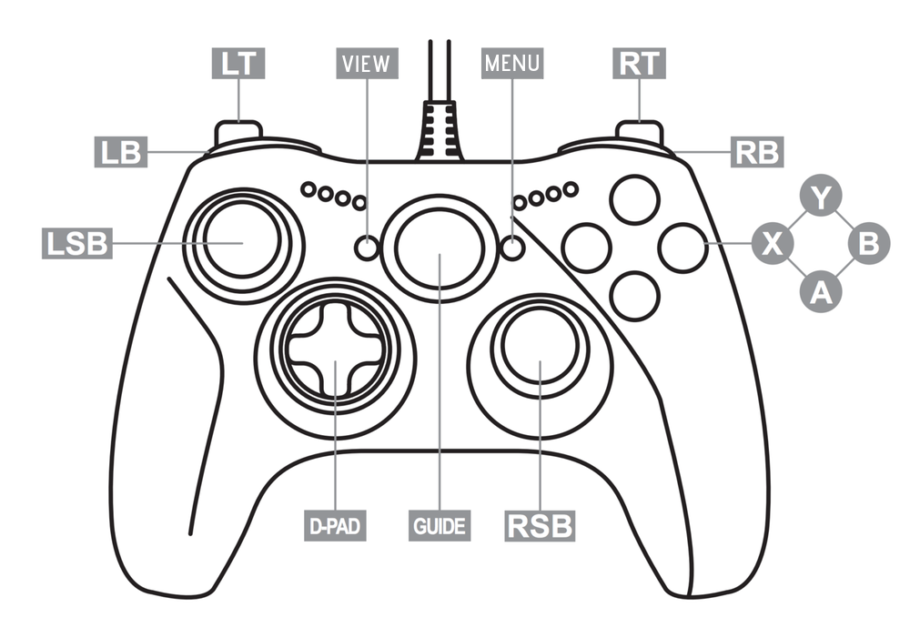

# Viz_JoystickTester.js [MZ] (v1.0.0)

Plugin para RPG Maker MZ que registra en consola la actividad del mando o mandos conectados.

Está pensado para controles XBOX, que utilizan la API estándar "XInput".

Los controles de XBOX compatibles son:
* XBOX 360
* XBOX One
* XBOX Series X y S

Detecta controles de otros fabricantes, pero es posible que el mapeo sea diferente.